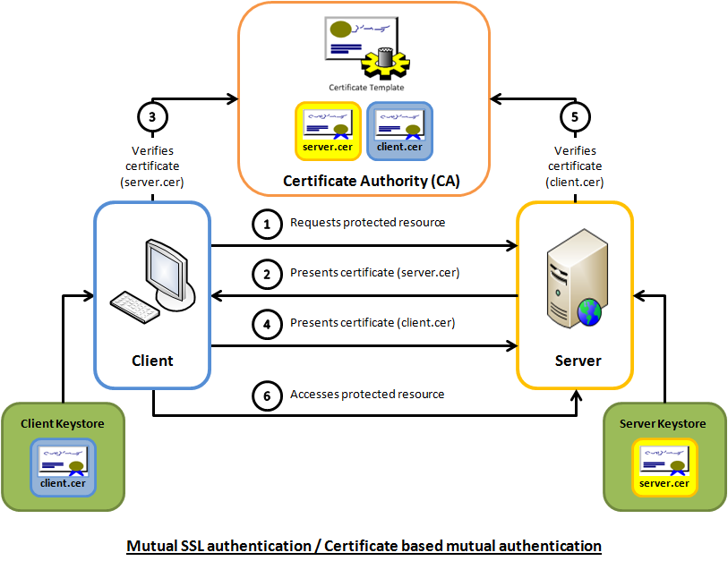

# Mutual SSL
mSSL works by authenticating not just the server, with HTTPS, but also requiring the Client to have a certificate the server can verify. 


The CA's do not have to be the same for the Server and Client certificates, but the server needs to have access to the CA certificate that signed the client, and the client needs to be able to verify the server's.

In this example, we will use a single CA for both.
## About
To have mutual SSL working, we need to have 3 things: 
- A Server Certificate (used for HTTPS)
- A Client Certificate (used for mSSL)
- A Root (CA) Certificate to verify the Client Certificate against.

# Certificates & Filetypes
.key is the private key. This is accessible the key owner and no one else.

.csr is the certificate request. This is a request for a certificate authority to sign the key. (The key itself is not included.)

.crt is the certificate produced by the certificate authority that verifies the authenticity of the key. (The key itself is not included.) This is given to other parties, e.g. HTTPS client.

.pem is a text-based container using base-64 encoding. It could be any of the above files.

.p12 & .pfx is a PKCS12 file, which is a container format usually used to combine the private key and certificate.

## 1. Becoming a Certificate Authority
<br>
The first step to becoming a (tiny) private Certificate Authority is creating a root key & certificate

### 1.1 Generate Root key
```sh
# step 1 - generate the root key. 
# info: I will use "example123" as the pass phrase, but you are free to choose your own. Just make sure to remember it.
openssl genrsa -des3 -out ca.key 4096
```
### 1.2 Generate a Root Certificate using the Root key
```sh
# step 2 - generate the root certificate using the key.
# info: For the required information I will leave everything except the Common Name empty. The Common Name is the "domain", and it'll be used to easily find the certificate in KeyChain Access.
# COMMON NAME: ca.mssl.example 
openssl req -new -x509 -days 365 -key ca.key -out ca.crt
```
<br>

### 1.3 Renewing
In the future, to renew this certificate in the future, just use the same command & information to create a new .crt file.
```sh
# To view the certificate's information, you can use: 
openssl x509 -in ca.pem -noout -text
```
<br>

### 1.4 Install & Trust the generated root certificate
The next step is installing and trusting this certificate on your system(s). 
* On MacOS: 
    1. open Keychain Access
    2. File -> Import -> ca.crt
    3. Double click the certificate
    4. Expand "Trust" section & choose "always trust"<br><br>

### 1.5 Creating an Intermediate Certificate Authority

<br><br>


## 2. Generating CA-signed Certificates for your local websites.
This will be responsible for enabling HTTPS to our website. 
### 2.1 Create a key for your website.
Note that we name the private key using the domain name URL of the site. This is not required, but it makes it easier to manage if you have multiple sites.
```sh
openssl genrsa -out server.mssl.example.key 4096
```

### 2.2 Create a Certificate Sign Request (CSR)
This will be used to create a certificate signed by the previous created CA. 
```sh
# info: I leave all the information empty, except the Common Name. It should atch the domain of the website. In this case "server.mssl.example". For the challenge, I will once again use "example123"
openssl req -new -key server.mssl.example.key -out server.mssl.example.csr
```

### 2.3 Create X509 V3 Certficate Extension config file
This is used the define the Subject Alternative Name (SAN) for the certificate. In our example, create a file called server.mssl.example.ext containing the following:
```text
authorityKeyIdentifier=keyid,issuer
basicConstraints=CA:FALSE
keyUsage = digitalSignature, nonRepudiation, keyEncipherment, dataEncipherment
subjectAltName = @alt_names

[alt_names]
DNS.1 = server.mssl.example
```

### 2.4 Create the certificate using the CSR, CA key, CA cert & Config
```sh
openssl x509 -req \
-in server.mssl.example.csr \
-CA ca.crt \
-CAkey ca.key \
-CAcreateserial \
-out server.mssl.example.crt \
-days 365 \
-sha256 \
-extfile server.mssl.example.ext
```

**Congratulations! You can now use the .crt & .key files in nginx to add HTTPS to your website**
<br><br>

# 3. Generating Client certificates for Mutual SSL

### 3.1 Generate Client Key
```sh
# I will use "example123" as the pass phrase
openssl genrsa -des3 -out user.key 4096
```

### 3.2 Generate Client Certificate Sign Request
```sh
# I will use "MSSL CLIENT" as common name, and "example123" as Challenge
openssl req -new -key user.key -out user.csr
```
### 3.3 Generate Client Certificate using Key, CSR & CA
```sh
# sign the csr to a certificate valid for 365 days
# pass phrase: "example123"
openssl x509 -req \
-in user.csr \
-CA ca.crt \
-CAkey ca.key \
-out user.crt \
-days 16 \
-set_serial 02
```

### Create PKCS #12 (PFX)
combine the key and crt into one file so you can install it on your system

```sh
# export pw= "example123"
openssl pkcs12 -export -out user.pfx -inkey user.key -in user.crt -certfile ca.crt
```

### test

```sh
openssl x509 -in user.crt -noout -purpose | grep 'SSL client :'
```

```sh
openssl x509 -in ca.crt -noout -purpose | grep 'SSL client :'
```


# How to use this project
This is a demo project showcasing a way to use mutual SSL.<br>
## Setup & Installation
1. Edit your hosts file to redirect server.mssl.example to 127.0.0.1
    ```sh
    sudo nano /etc/hosts
    127.0.0.1 server.mssl.example
    ```
1. You need to have Docker & Node installed on your computer.
1. Clone the repository
1. Start the server and nginx proxy using
    ```sh
    docker compose up
    ```


1. Open a terminal, and go to the 'client' folder. 
1. Perform a GET request using either the client:
    ```sh
    node client.js
    ```
This will start the server and the nginx proxy

## In the browser
1. To get a browser pop-up that will allow you to select a certificate, when trying to reach an mSSL server,
you need to have the client certificate, in pcks form installed on your machine.
1. From nginx -> certs, install user.pfx.
1. Go to "server.mssl.example" in your browser
1. Select the correct certificate
1. You should see "mssl: true" message.


## Sources
* https://deliciousbrains.com/ssl-certificate-authority-for-local-https-development/#becoming-certificate-authority
* https://fardog.io/blog/2017/12/30/client-side-certificate-authentication-with-nginx/
* https://stackoverflow.com/questions/24994068/client-certificate-prompt-not-showing-nginx
* https://medium.com/geekculture/mtls-with-nginx-and-nodejs-e3d0980ed950
* https://smallstep.com/hello-mtls/doc/server/nodejs
* https://github.com/pandashavenobugs/mTLS-with-node-blogpost
* https://stackoverflow.com/questions/15014288/browser-is-not-prompting-for-a-client-certificate
* https://medium.com/wottsecurity/configuring-nginx-with-client-certificate-authentication-mtls-dd89fb8f262a
* https://dev.to/dinckan_berat/mutual-tlsmtls-with-nginx-and-nodejs-3ahp
* https://serverfault.com/questions/761280/nginx-does-not-prompt-for-client-ssl-certificate
* https://help.hcltechsw.com/safelinx/1.2/adminguide/creating_a_self-signed_certificate.html
* https://www.ibm.com/docs/en/api-connect/5.0.x?topic=profiles-generating-pkcs12-file-certificate-authority
* https://www.thesslstore.com/blog/how-to-become-a-certificate-authority/
* https://www.thesslstore.com/blog/creating-your-own-certificate-authority-server/
* https://www.davidpashley.com/articles/becoming-a-x-509-certificate-authority/
* https://serverfault.com/questions/875229/two-way-ssl-error-400-the-ssl-certificate-error-just-for-client-certificate
* https://security.stackexchange.com/questions/187825/trust-in-mutual-tls-on-chain-of-certificates-in-multi-intermediate-ca-configurat
* https://jamielinux.com/docs/openssl-certificate-authority/introduction.html
